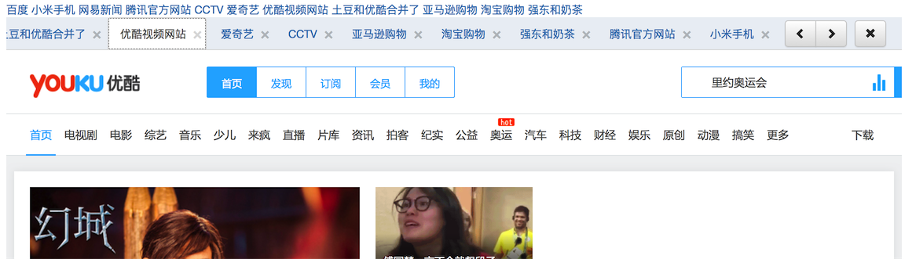

标签页管理

本插件依赖 jquery以及Bootstrap 3.0+




## 调用

```
    $("#topnav").navtab({taboffset:50});
```

## 添加标签页

```
        $("#topnav").navtab("add",{
            title:"标题",
            url: "http://baidu.com"
            //content:"<h1>标题</h1>"
        });
```

